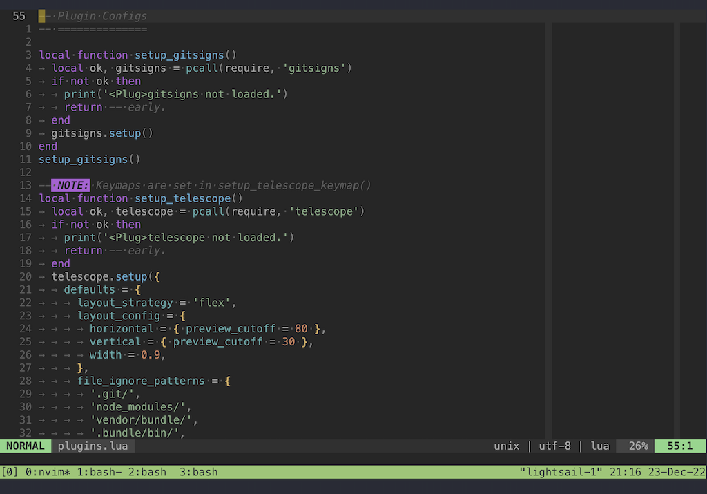

# Eddinvim

Edditoria <3 Neovim

This is a personal project to store my Neovim configurations. All things are work-in-progress, including this README doc. Welcome any comments and issues.

## My Usage

- Mainly use Neovim on iPad via Mosh/SSH connection, i.e. relatively small screen, and bad connection sometimes.
- Often run on a weak server.
- Plugins are managed using "vim-plug".
- I'm a noob. I'm still experiencing the power of Neovim. Expect a lot of changes.

## Prerequisites

- Neovim 0.8.0 or later built with tree-sitter, of cause: [link](https://neovim.io).
- "vim-plug": [link](https://github.com/junegunn/vim-plug#neovim).
- ... (work-in-progress...)

## Setup

Please clone this project in an individual directory, so it won't mess up your current configs:

```sh
mkdir -p ~/.config/nvim/lua
cd ~/.config/nvim/lua
git clone https://github.com/Edditoria/eddinvim.git
cd ~/.config/nvim
```

At this point, all files are available in directory `~/.config/nvim/lua/eddinvim`.

Now, insert these lines in your own `~/.config/nvim/init.lua`:

```lua
-- You may have these lines already:
vim.scriptencoding = 'utf-8'
vim.opt.encoding = 'utf-8'
vim.opt.fileencoding = 'utf-8'

-- Require them one-by-one:
require('eddinvim.base')
require('eddinvim.plugins')
require('eddinvim.keymap')
require('eddinvim.colorscheme')
```

In Neovim, run `:PlugInstall` to install all plugins. Run `:TSUpdate` to update all Treesitter languages.

And boom!~~~



## Problems/Issues

I'm still learning. There are lots of things I don't understand. For example:

- What is the impact of using true color themes on Mosh/SSH connection?
- What is the impact of using special fonts (e.g. nvim-web-devicons) on Mosh/SSH connection?
- A lot of `TODO` in the Lua files.
- ... (work-in-progress...)

---

Work-in-progress...
